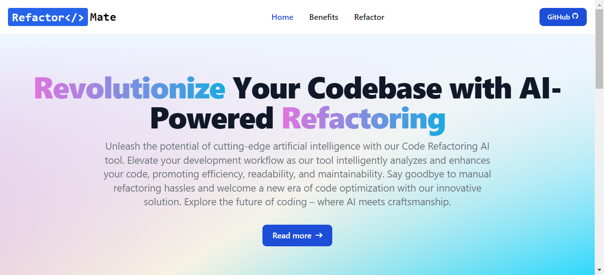
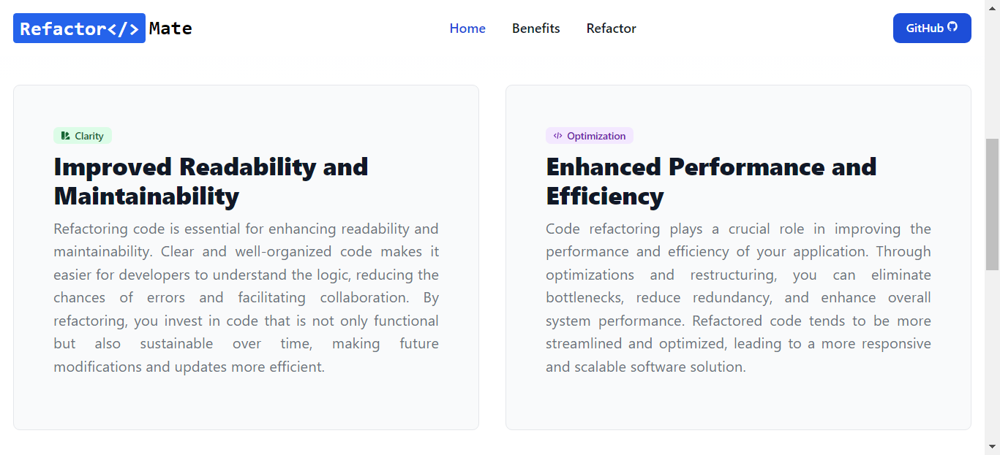
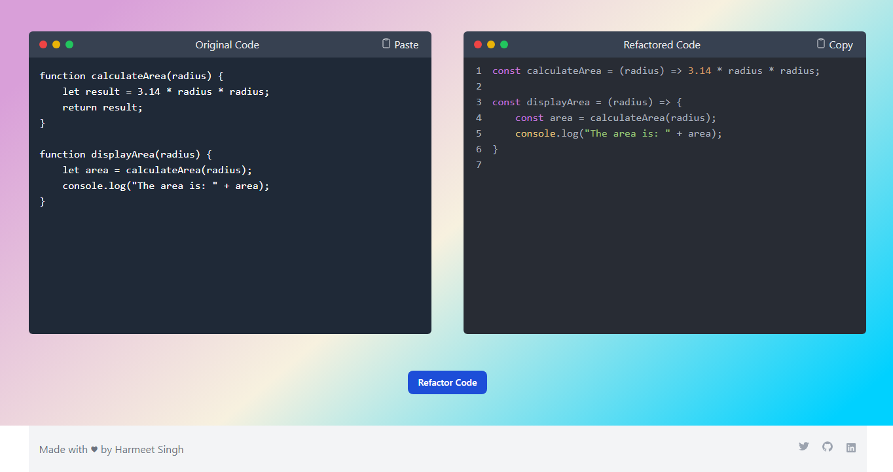

# RefactorMate - Your Code Refactoring Companion

RefactorMate is a powerful code refactoring tool that harnesses the capabilities of the GPT-3.5-turbo model from OpenAI to streamline and enhance your coding experience. Whether you're a seasoned developer looking to optimize your code or a beginner learning the ropes, RefactorMate is here to make your coding journey smoother and more efficient.

## Table of Contents

- [Features](#features)
- [Prerequisites](#prerequisites)
- [Tech Stack](#tech-stack)
- [Dependencies](#dependencies) 
- [Getting Started](#getting-started)
- [Screenshots](#screenshots)
- [Demo Video](#demo-video)
- [Contributing](#contributing)


## Features

### 1. Code Refactoring Made Easy

RefactorMate simplifies the code refactoring process. Just input your code, and let the GPT-3.5-turbo model analyze and suggest improvements. The intelligent suggestions provided by the model aim to enhance readability, improve performance, and adhere to best coding practices.

### 2. Seamless Integration with ChatGPT

Our app seamlessly integrates with ChatGPT, providing an interactive and user-friendly interface. Communicate with ChatGPT to refine your refactoring preferences, ask questions about the suggested changes, or seek additional guidance on coding practices.

### 3. Language Agnostic

RefactorMate supports a wide range of programming languages. Whether you're coding in Python, JavaScript, Java, C++, or any other language, RefactorMate is designed to accommodate your needs.

### 4. Learn as You Refactor

RefactorMate is not just a tool; it's a learning companion. Gain insights into coding best practices, understand the rationale behind suggested changes, and enhance your coding skills with each refactoring session.


## Prerequisites

Before you begin, ensure you have the following software installed on your machine:

- [Node.js](https://nodejs.org/) - Make sure to install a version that is compatible with the project.
- [npm](https://www.npmjs.com/) - Node.js package manager.
- [Git](https://git-scm.com/) - Version control system.
  
## Tech Stack


## Dependencies

### Dependencies

- **@types/node**: ^20.9.2
  - Description: TypeScript definitions for Node.js.
- **cors**: ^2.8.5
  - Description: Middleware to enable CORS (Cross-Origin Resource Sharing) in your Express app.
- **dotenv**: ^16.3.1
  - Description: Loads environment variables from a .env file into process.env.
- **express**: ^4.18.2
  - Description: Fast, unopinionated, minimalist web framework for Node.js.
- **openai**: ^4.19.0
  - Description: OpenAI API client for interacting with the GPT model.
- **react**: ^18.2.0
  - Description: A JavaScript library for building user interfaces.
- **react-dom**: ^18.2.0
  - Description: React package for working with the DOM.
- **react-syntax-highlighter**: ^15.5.0
  - Description: Syntax highlighting component for React using `react-syntax-highlighter`.
- **ts-node**: ^10.9.1
  - Description: TypeScript execution environment and REPL for Node.js.

### Development Dependencies

- **@types/cors**: ^2.8.16
  - Description: TypeScript definitions for the `cors` package.
- **@types/express**: ^4.17.21
  - Description: TypeScript definitions for the `express` package.
- **@types/react**: ^18.2.37
  - Description: TypeScript definitions for React.
- **@types/react-dom**: ^18.2.15
  - Description: TypeScript definitions for React DOM.
- **@types/react-syntax-highlighter**: ^15.5.10
  - Description: TypeScript definitions for `react-syntax-highlighter`.
- **@typescript-eslint/eslint-plugin**: ^6.10.0
  - Description: ESLint plugin for TypeScript.
- **@typescript-eslint/parser**: ^6.10.0
  - Description: ESLint parser for TypeScript.
- **@vitejs/plugin-react**: ^4.2.0
  - Description: Vite plugin for React.
- **autoprefixer**: ^10.4.16
  - Description: PostCSS plugin to parse CSS and add vendor prefixes automatically.
- **eslint**: ^8.53.0
  - Description: A pluggable and configurable linter tool for identifying and fixing problems in JavaScript code.
- **eslint-plugin-react-hooks**: ^4.6.0
  - Description: ESLint plugin for React hooks.
- **eslint-plugin-react-refresh**: ^0.4.4
  - Description: ESLint plugin for React Refresh.
- **postcss**: ^8.4.31
  - Description: A tool for transforming styles with JavaScript plugins.
- **tailwindcss**: ^3.3.5
  - Description: A utility-first CSS framework.
- **typescript**: ^5.2.2
  - Description: A superset of JavaScript that compiles to clean JavaScript output.
- **vite**: ^5.0.0
  - Description: A blazing-fast build tool that scales to large projects.


## Getting Started

Follow these steps to get your project up and running locally:

### 1. Clone the Repository

Open your terminal and clone the project repository:

```bash
git clone https://github.com/harmeetsingh11/RefactorMate.git
```
### 2. Navigate to the Project Directory
Move to the Project directory:

```bash
cd .\RefactorMate\
```

### 3. Install Dependencies
Install the dependencies using npm:

```bash
npm install
```
### 4. Get OpenAI API Key

Get API Key [here](https://openai.com/product)

Configure API key in `index.ts` 

```ts
const API_KEY:string="YOUR_OPENAI_API_KEY"
```

### 5. Run the Client (Frontend)
Start the frontend application:

```bash
npm run frontend
```
The client will be accessible at http://localhost:5173 by default.

### 6. Run the Server (Backend)
Start the backend:

```bash
npm run backend
```
The server will be running at `PORT:8000`

### Screenshots





### Demo video

<video src="public/screenshots/demo.mp4" controls title="Demo"></video>
## Demo Video


## Contributing

We welcome and appreciate contributions from the community! If you find a bug, have a feature request, or would like to contribute in any way, feel free to open an issue or submit a pull request. Whether you're fixing a typo or adding a new feature, your efforts are valued, and together we can make this project even better. Thank you for considering contributing to RefactorMate!
